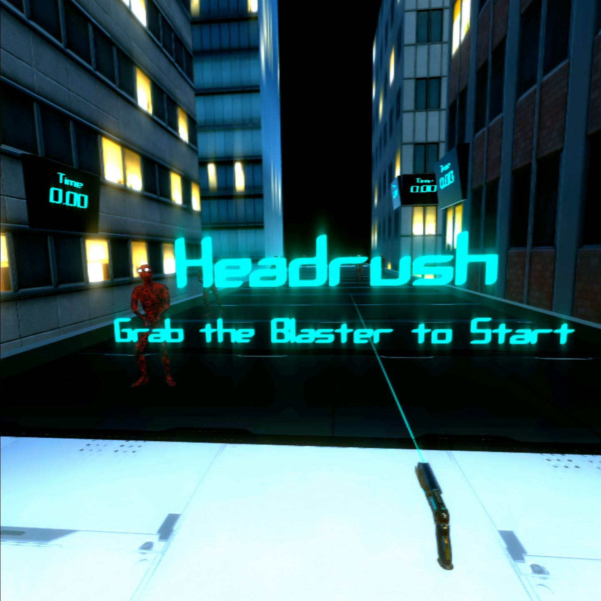
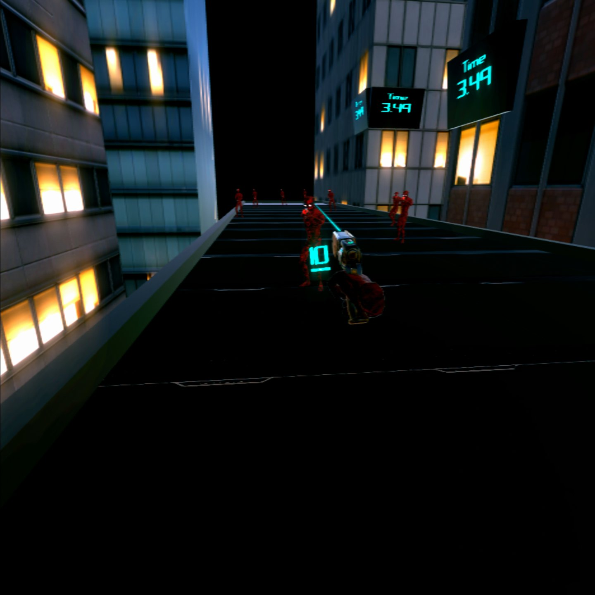
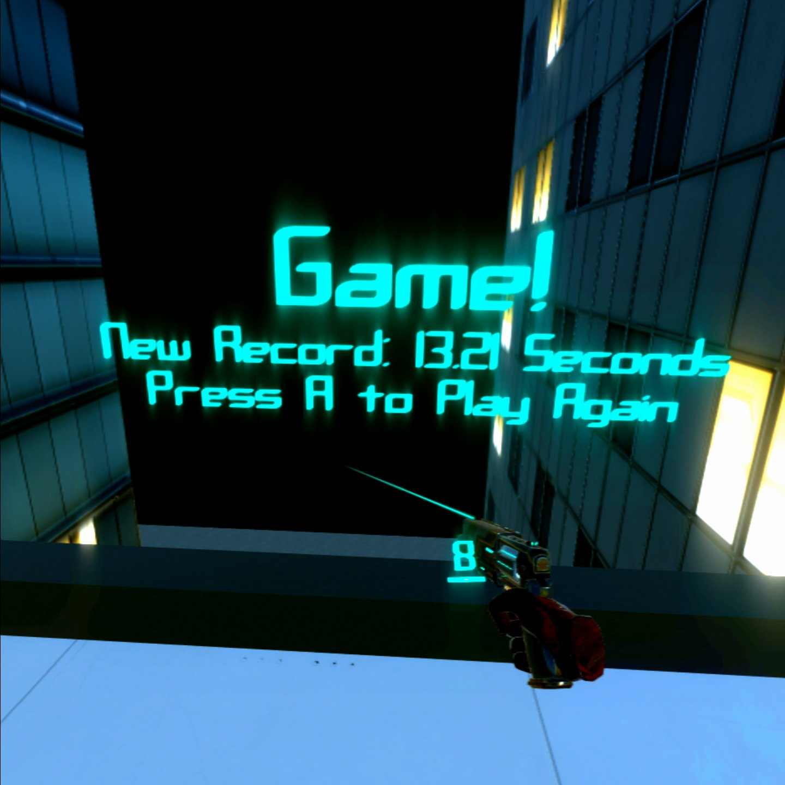
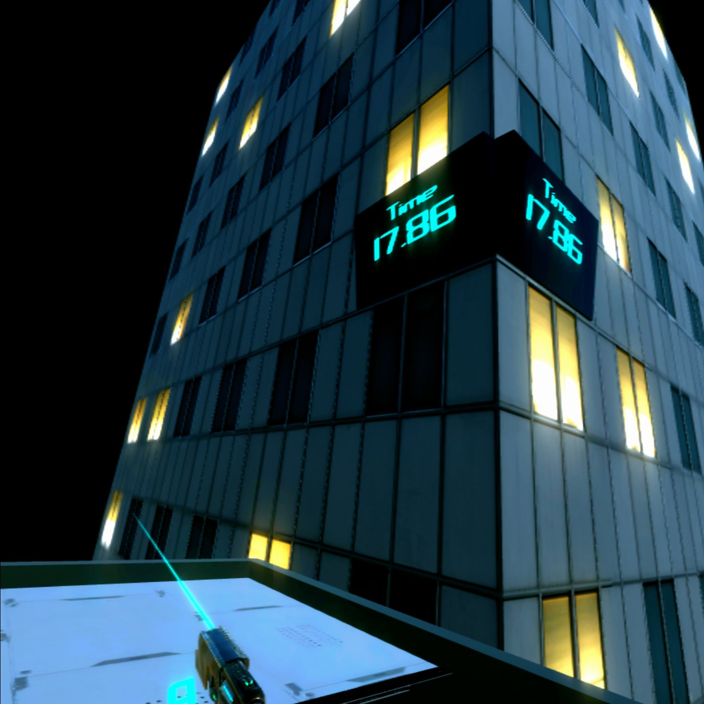
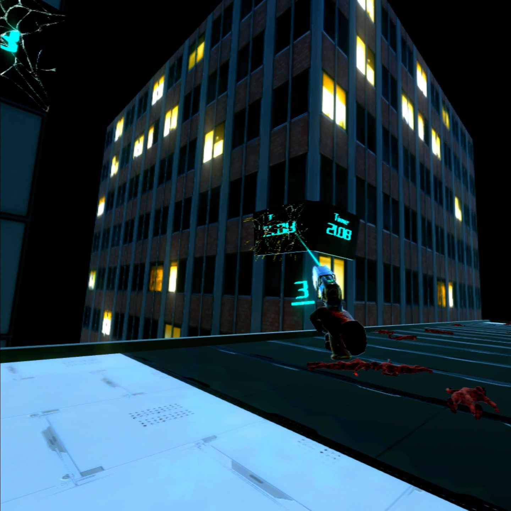
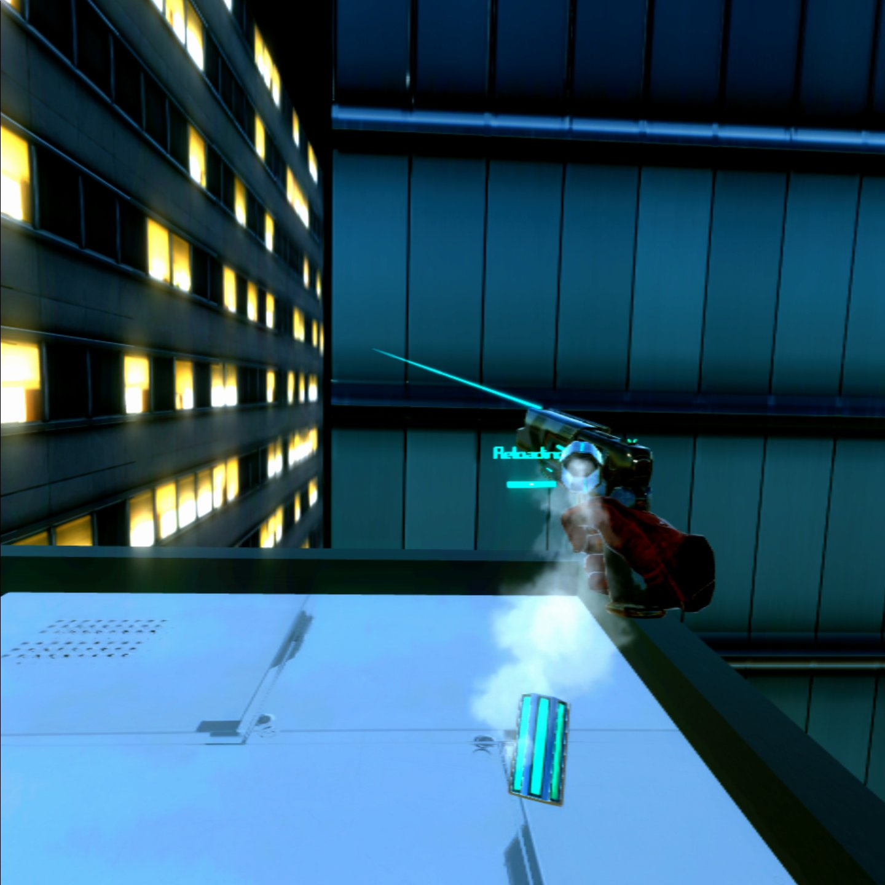
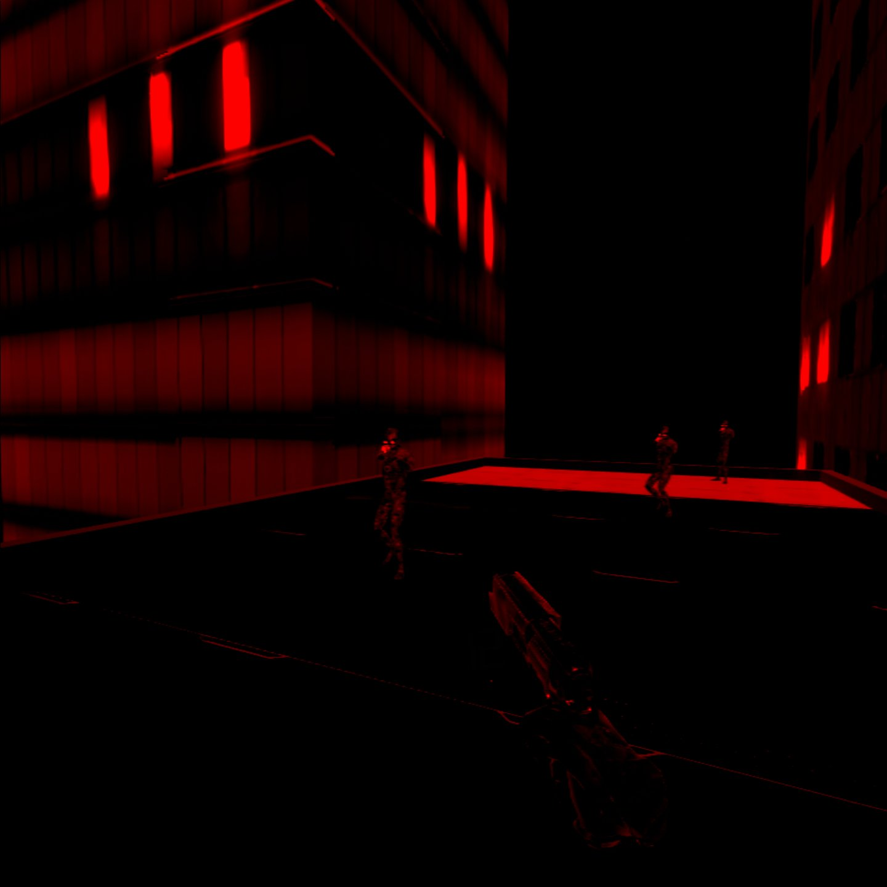

# Headrush

HeadRush is a time-trial/shooter VR game developed for the Oculus Quest. This 

### Build Instructions ###
After cloning the repository:
1. In Unity, go to: File -> Build Settings
2. Ensure MainScene is selected to build 
3. Select Android Platform and press 'Switch Platform', unless already selected
4. Choose ASTC in the 'Texture Compression' dropdown
5. Connect Oculus VR device to your machine, and select it in the 'Run Device' dropdown
6. Build and Run. The build should start automatically on the device, if not, it will be located in Library -> Unknown Sources -> Headrush)
- *Note: Builds have only been tested on the Oculus Quest, but should be compatible with Oculus Go)*
### How to play ###
The goal of the game is to reach the other end of the rooftop as fast as possible. The player wields a blaster that can hack into enemy droids (similar to the ['shift' mechanic/ability](https://youtu.be/bI3CPh7vidg?t=85) in the Driver: San Francisco game). However, this only works with a shot to the head. Jump from droid to droid to get to the finish. Vision becomes more red as the player takes more damage. Health can be restored by hacking into a healthy droid.

### Demo ###
Check out gameplay footage: [Youtube link](https://youtu.be/HBu7PsjabS8).

### Screen Shots ###

